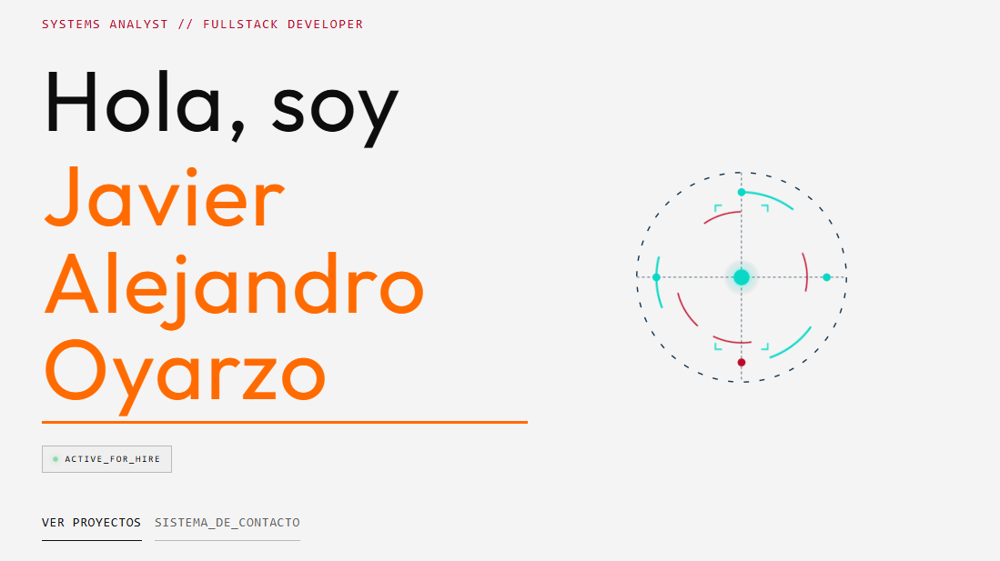

# Portfolio de Desarrollo Web



## Descripción
Este proyecto es mi portafolio personal que muestra mis habilidades y proyectos desarrollados. Incluye una web responsiva con diseños modernos, utilizando React.

## Tecnologías Utilizadas
- **HTML5** – Estructura semántica.
- **CSS3** – Diseño moderno con flexbox, grid y animaciones.
- **JavaScript (ES6+)** – Interactividad y lógica de la aplicación.
- **Node.js & npm** – Servidor de desarrollo y gestión de dependencias.
- **React** – Libreria para la construcción de interfaces de usuario.
- **Vite** – Entorno de desarrollo rápido y eficiente.

## Instalación
1. **Clonar el repositorio**
   ```bash
   git clone https://github.com/tu-usuario/portfolio.git
   cd portfolio
   ```
2. **Instalar dependencias**
   ```bash
   npm install
   ```
3. **Ejecutar la aplicación en modo desarrollo**
   ```bash
   npm run dev
   ```
   La aplicación estará disponible en `http://localhost:5173`.

## Uso
- Navega por las diferentes secciones del portafolio.
- Cada proyecto incluye una breve descripción, tecnologías usadas y enlaces a repositorios o demos.
- El sitio está optimizado para dispositivos móviles y escritorio.

## Contribución
Si deseas contribuir, sigue estos pasos:
1. Forkea el proyecto.
2. Crea una rama para tu característica (`git checkout -b feature/nueva-funcionalidad`).
3. Abre un Pull Request describiendo los cambios.

---
*¡Gracias por visitar mi portafolio!*
